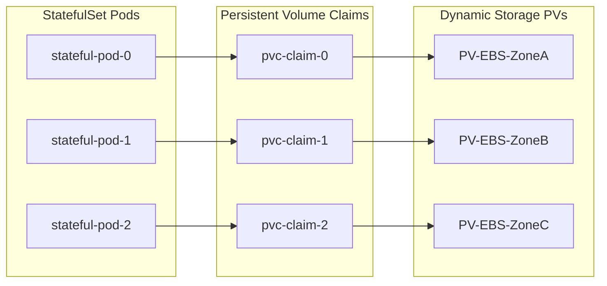

# 🗄️ Enterprise Data Platform & Stateful Workloads Architecture

Running stateful workloads (databases, caches, message queues) in Kubernetes requires specialized storage configurations, state synchronization controllers, and strict disaster recovery strategies.

---

## 1. StatefulSet Architecture & Lifecycle

Unlike stateless Deployments, `StatefulSets` maintain a sticky identity for each pod. Pods are created sequentially (0 to N-1) and retain their network identity and persistent volume mapping across restarts.



---

## 2. Storage Class Selection: Local vs Networked

Deciding on storage engines is a classic SRE trade-off:

| Storage Type | Write/Read IOPS | Latency | Zone Failures | Provisioning | Typical Workload |
| :--- | :--- | :--- | :--- | :--- | :--- |
| **Local NVMe SSDs** | Extremely High | Sub-millisecond | Pod must be rescheduled to same node (data loss if node dies) | Manual or local-volume-provisioner | ScyllaDB, Cassandra, Kafka logs |
| **Cloud Block Storage (EBS, PD)** | Moderate/High | 2ms - 10ms | Cloud provider replicates block device within Zone. Pod can mount it on other nodes in the same zone. | Dynamic Storage Classes | PostgreSQL, MySQL, Redis |
| **Distributed Storage (Rook-Ceph)**| High | 5ms - 15ms | Survives entire zone loss if Ceph replicated across zones | Dynamic Storage Classes | Shared File Systems, Object stores |

---

## 3. High Availability Databases (e.g., PostgreSQL Operator)

We use Postgres Operators (like Crunchy Data or Zalando pg-operator) to automate failover, connection pooling, and backups.

### Patroni Leader Election Workflow:
1. Pod 0 starts as Leader and acquires a lease in etcd/Consul.
2. Pod 1 and Pod 2 sync database replicas from Pod 0 via streaming replication.
3. If Pod 0 experiences a node failure:
   - The lease expires.
   - Pod 1 or 2 initiates an election.
   - The winner is promoted to primary.
   - The Service points writing traffic to the new leader immediately.

---

## 4. Manifest Blueprint: High Performance PostgreSQL StatefulSet

```yaml
apiVersion: storage.k8s.io/v1
kind: StorageClass
metadata:
  name: gp3-ebs-retain
provisioner: ebs.csi.aws.com
volumeBindingMode: WaitForFirstConsumer
reclaimPolicy: Retain
parameters:
  type: gp3
  iops: "3000"
  throughput: "125"
  encrypted: "true"
---
apiVersion: apps/v1
kind: StatefulSet
metadata:
  name: postgres-db
  namespace: production-app
spec:
  serviceName: postgres-db-svc
  replicas: 3
  selector:
    matchLabels:
      app: postgres-db
  template:
    metadata:
      labels:
        app: postgres-db
    spec:
      containers:
      - name: postgres
        image: postgres:15-alpine
        resources:
          requests:
            cpu: "2"
            memory: "4Gi"
          limits:
            cpu: "4"
            memory: "8Gi"
        ports:
        - name: dbport
          containerPort: 5432
        volumeMounts:
        - name: pg-data
          mountPath: /var/lib/postgresql/data
  volumeClaimTemplates:
  - metadata:
      name: pg-data
    spec:
      accessModes: [ "ReadWriteOnce" ]
      storageClassName: gp3-ebs-retain
      resources:
        requests:
          storage: 100Gi
```

---

## 5. Backup & Recovery: Velero and CSI Snapshots

To maintain business continuity, stateful volumes are backed up using CSI snapshots:
* **Velero Integration:** Works at the control plane level to backup cluster resources, and requests CSI snapshots from the cloud provider for physical persistent volumes.
* **Write-Ahead Logging (WAL) Archival:** Database engines continually stream WAL files to secure, encrypted S3 buckets for point-in-time recovery (PITR) workflows.
* **Testing Recovery Pipelines:** SRE squads run monthly automated test restorations in isolated sandbox clusters to ensure RPO (Recovery Point Objective) and RTO (Recovery Time Objective) compliance.
