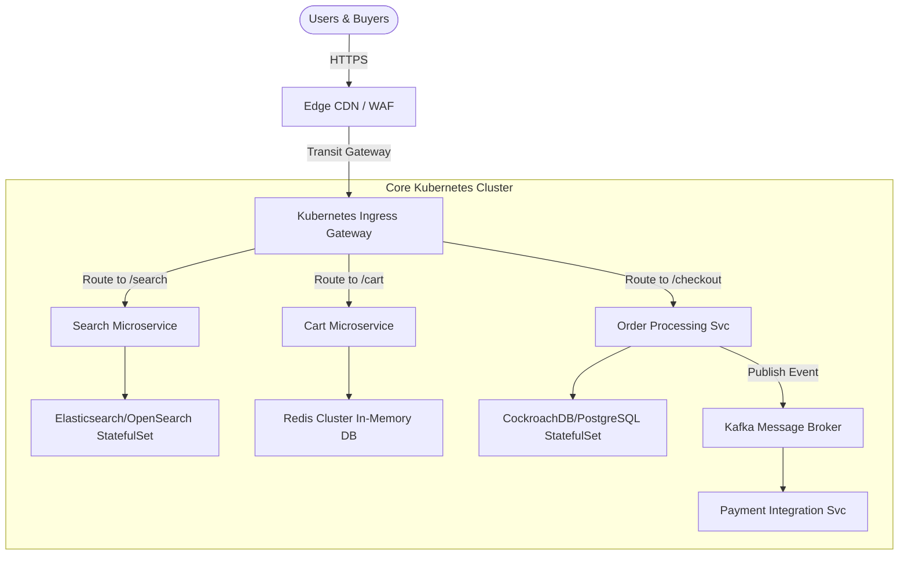

# 🛒 Enterprise E-commerce Platform Architecture on Kubernetes

This architecture blueprint details the design, latency optimization, and resilience strategies required to run high-volume, low-latency e-commerce platforms on production Kubernetes clusters.

---

## 1. Multi-Tier Microservices Topology

An enterprise e-commerce platform relies on decoupled microservices to manage inventories, carts, accounts, search indices, and payments.



---

## 2. Low-Latency Networking & Caching Layer

Latency directly impacts e-commerce conversions. SREs enforce the following optimizations:
* **Service Mesh (Istio) Tuning:** mTLS is configured for TCP reuse and keep-alives. Istio proxies use sidecar resource configurations to prevent memory inflation during traffic spikes.
* **Redis Cluster Setup:** Shopping carts are stored in memory with high availability (primary-replica) across availability zones.
* **Session Affinity:** For services requiring session state preservation, we apply Ingress cookie-based sticky sessions:
  ```yaml
  nginx.ingress.kubernetes.io/affinity: "cookie"
  nginx.ingress.kubernetes.io/session-cookie-name: "route"
  nginx.ingress.kubernetes.io/session-cookie-hash: "sha1"
  ```

---

## 3. Designing for Flash Sales: Dynamic Scaling & Overprovisioning

Flash sales generate extreme traffic spikes that scale up too fast for standard HPA. SRE squads use a multi-pronged scaling strategy:

### A. Dynamic HPA with Cron Scalers (KEDA)
Instead of waiting for CPU/Memory triggers, the system pre-scales using KEDA (Kubernetes Event-driven Autoscaling) before the event begins.
```yaml
apiVersion: keda.sh/v1alpha1
kind: ScaledObject
metadata:
  name: backend-cron-scaler
  namespace: production-app
spec:
  scaleTargetRef:
    apiVersion: apps/v1
    kind: Deployment
    name: ecom-backend
  minReplicaCount: 3
  maxReplicaCount: 50
  triggers:
  - type: cron
    metadata:
      timezone: America/New_York
      start: "30 11 * * *" # Pre-scale 30 mins before 12:00 sale
      end: "00 14 * * *"   # Scale down after traffic subsides
      desiredReplicas: "30"
```

### B. PriorityClasses & Overprovisioning
To handle immediate surges while waiting for new nodes to provision, we run lower-priority "Pause Pods" that occupy compute capacity. When a high-priority checkout pod spawns, the cluster evicts the Pause Pods instantly, reserving their resources.

---

## 4. Database Transaction Consistency & Write Mitigation

To avoid database locking and resource exhaustion during checkout rushes:
* **Kafka Queuing:** Checkouts are written to a fast Kafka stream instead of direct database inserts. Order workers process the queue asynchronously, protecting database storage pools from write-saturation failures.
* **Read-Write Splitting:** Catalog views pull from multi-region read replicas, while transaction systems write to highly resilient master databases.
* **Circuit Breaking:** If downstream payment gateways fail, the order service fails gracefully by storing cart states in Redis and notifying the customer that confirmation is pending, avoiding stack dump crashes.
