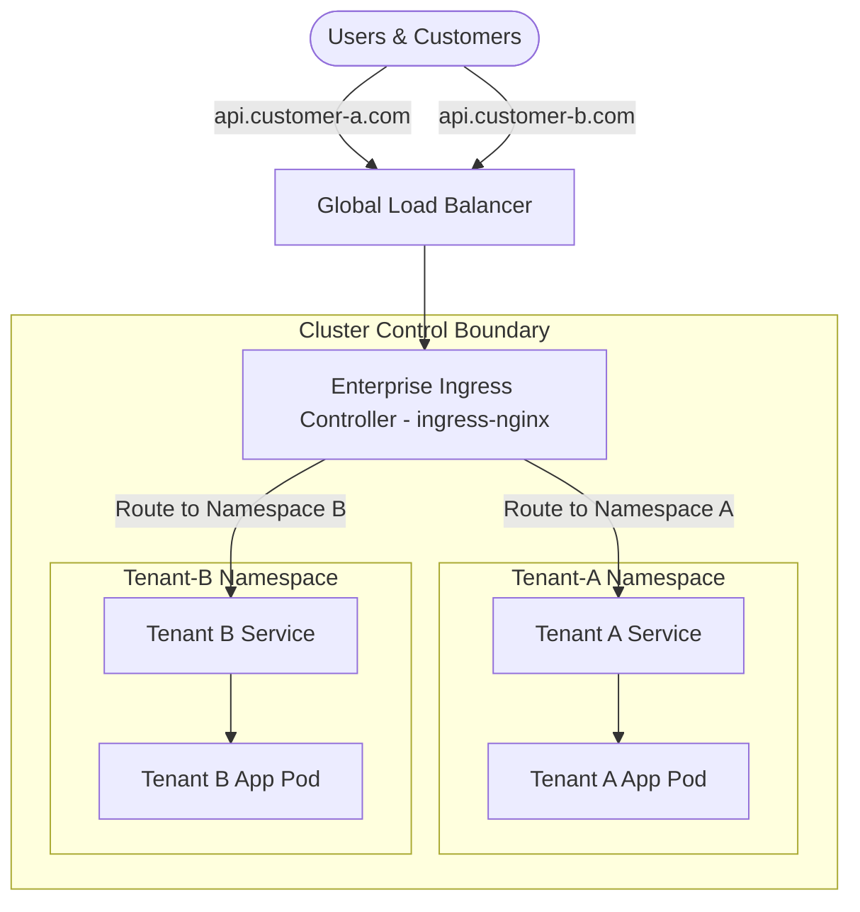

# 🏢 Enterprise Multi-Tenant SaaS Platform Architecture

This architecture blueprint details the design principles, tenant isolation strategies, and infrastructure segregation topologies used to run multi-tenant Software-as-a-Service (SaaS) systems on production Kubernetes.

---

## 1. Isolation Strategy Matrix

When designing a SaaS platform on Kubernetes, isolation can be achieved at multiple levels. The choice depends on compliance requirements, noise tolerance, cost sensitivity, and API security.

| Tier | Isolation Model | Compute Sharing | Network Isolation | Control Plane Sharing | Cost/Tenant |
| :--- | :--- | :--- | :--- | :--- | :--- |
| **Tier-3 (Free/Basic)** | Namespace Isolation | Shared Node Groups | Namespace-level NetworkPolicies | Shared Control Plane | Very Low |
| **Tier-2 (Growth)** | Node-Group Isolation | Dedicated Node Pools (Taints/Tolerations) | Dedicated NetworkPolicies + Envoy Routing | Shared Control Plane | Medium |
| **Tier-1 (Enterprise)** | Cluster Isolation | Dedicated cluster per tenant | VPC Peering / Private Links | Dedicated Control Plane | High |

---

## 2. Ingress & Traffic Routing Architecture

In a SaaS application, routing incoming requests to the correct tenant's workload is critical. We utilize dynamic wildcard ingress routers and headers-based routing rules.



### Path-Based vs Subdomain Routing
* **Subdomain-Based Routing:** Every customer gets a unique DNS label (`tenant-a.saas.com`). Ingress configurations dynamically map hosts to specific Kubernetes services within isolated namespaces.
* **Header-Based Routing:** A shared API Gateway (e.g., Kong, Envoy, Traefik) intercepts traffic, validates a JWT, extracts the `Tenant-ID` header, and rewrites the routing endpoint dynamically.

---

## 3. Worker Node Segmentation & Scheduling

To avoid "noisy neighbors" (where one tenant consumes node resources, starving others), we use node affinity, taints, and tolerations.

### Scenario: Scheduling Tenant-A on Dedicated Compute
```yaml
apiVersion: apps/v1
kind: Deployment
metadata:
  name: tenant-a-processor
  namespace: tenant-a
spec:
  replicas: 2
  template:
    metadata:
      labels:
        tenant: tenant-a
    spec:
      tolerations:
      - key: "tenant"
        operator: "Equal"
        value: "tenant-a"
        effect: "NoSchedule"
      affinity:
        nodeAffinity:
          requiredDuringSchedulingIgnoredDuringExecution:
            nodeSelectorTerms:
            - matchExpressions:
              - key: tenant-tier
                operator: In
                values:
                - tenant-a-dedicated
```

---

## 4. Tenant Cost Allocation & Resource Quotas

To track unit economics and ensure billing accuracy, resource constraints and tracking tags are applied per namespace.

1. **ResourceQuotas:** Restricts CPU, Memory, and Storage volume usage per tenant namespace to prevent API starvation.
2. **LimitRanges:** Enforces default resource configurations on pods spawned within tenant boundaries.
3. **Kubecost Integration:** Cost tracking is calculated by mapping Kubernetes namespace labels to custom billing parameters:
   ```yaml
   apiVersion: v1
   kind: Namespace
   metadata:
     name: tenant-a
     labels:
       tenant: "tenant-a"
       billing-tier: "premium"
       cost-center: "finance-dept"
   ```

---

## 5. Security Policies and Zero Trust

SaaS systems are prime targets for pivoting attacks. The platform enforces the following zero-trust configurations:
* **Storage Isolation:** Dynamic volume provisioning via StorageClasses using encryption keys unique to the tenant (`KMS`).
* **Service Mesh mTLS:** All inter-tenant and internal platform communication runs inside an Istio or Linkerd mesh with strict mTLS enabled.
* **Network隔离:** NetworkPolicies that strictly deny namespace cross-talk unless explicitly authorized (e.g., to query shared identity providers).
