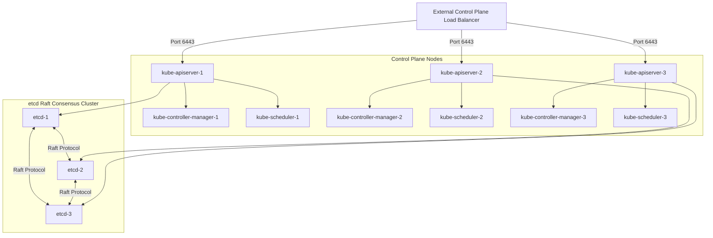

# ☸️ Production Control Plane High Availability & etcd Topology

Designing a production-grade Kubernetes cluster requires a control plane that can survive node failures, network partitioning, and maintenance operations without causing downtime.

---

## 1. Multi-Master Control Plane Architecture

A typical high-availability control plane consists of three master nodes running redundant services.

### Key Components Lifecycle in HA Mode:
* **`kube-apiserver` (Stateless):** Scaled horizontally. API servers do not talk to each other; they communicate exclusively with etcd. An external load balancer distributes client queries.
* **`kube-scheduler` & `kube-controller-manager` (Active/Passive):** Run leader-election loops. Only one instance actively runs logic, writing states back to the API Server. If the active leader fails, one of the passive instances acquires a lock and takes over.

---

## 2. etcd Quorum Mechanics & Sizing Rules

etcd uses the Raft consensus algorithm to maintain consistent cluster states. Raft requires a majority of active members to write updates.

### Quorum Calculation Formula:
$$\text{Quorum} = \lfloor N/2 \rfloor + 1$$

Where $N$ is the total number of members in the cluster.

| Cluster Size ($N$) | Quorum Required | Failure Tolerance | Why Even Numbers are Bad |
| :--- | :--- | :--- | :--- |
| **1** | 1 | 0 | Single Point of Failure (SPOF). |
| **3** | 2 | 1 | Optimal choice for medium production environments. |
| **5** | 3 | 2 | Standard choice for high-availability enterprise environments. |
| **4** | 3 | 1 | Requires same quorum as 5, but tolerates only 1 failure instead of 2. |

> [!WARNING]
> Never design an etcd cluster with an even number of nodes. It increases resource costs without improving failure tolerance.

---

## 3. Storage Performance (Fsync Latency)

etcd commits transactions to disk before notifying clients. If disk writes are slow, etcd logs warnings like `apply entries took too long` or `failed to send database commit heartbeat on time`, which can drop nodes from consensus.

### SRE Requirements for etcd Storage:
1. **Dedicated Disks:** etcd data directories should be mounted on separate, fast NVMe SSD drives to prevent contention from system logs or other services.
2. **Strict IOPS Constraints:** Enforce storage tiers with at least 3000-5000 IOPS and low fsync latency (ideally under 10ms at p99).
3. **Bandwidth Configuration:** Restrict etcd bandwidth allocations in VMs to prevent network starvation during snapshot syncs.

---

## 4. API Server Load Balancer Design

Clients (kubectl, worker node Kubelets, controllers) access the control plane via a single DNS endpoint mapping to a layer-4 TCP Load Balancer (e.g., AWS NLB, GCP ILB, HAProxy).

* **Health Checking:** The load balancer queries the `/healthz` or `/livez` endpoints on port 6443 of each API server.
* **Sticky Sessions:** Not required. Request flows can be routed round-robin because API servers are stateless and query the shared etcd back-end.
