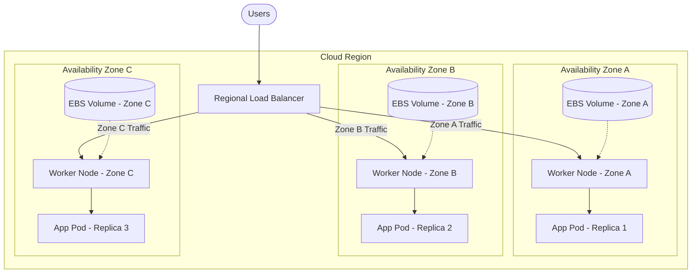

# 🌐 Multi-Zone Worker Node Pools & Resilience Design

This guide details how to spread applications, persistent volumes, and control systems across multiple Availability Zones (AZs) to prevent zone failures from taking down services.

---

## 1. Multi-Zone Cluster Architecture

To build a resilient platform, worker nodes are distributed across three distinct availability zones in a cloud region.



---

## 2. Pod Topology Spread Constraints

By default, the Kubernetes scheduler might pack multiple replicas on a single node or zone if resource conditions are tight. To enforce an even spread across zones, we use `topologySpreadConstraints`.

### YAML Spec Configuration
This block ensures that the difference in replica count between any two zones is never greater than 1 (`maxSkew: 1`).
```yaml
spec:
  topologySpreadConstraints:
  - maxSkew: 1
    topologyKey: topology.kubernetes.io/zone
    whenUnsatisfiable: DoNotSchedule
    labelSelector:
      matchLabels:
        app: ecom-backend
```

---

## 3. Storage Affinity Challenges: Zone-Locked Volumes

A persistent volume created in Zone A is physically locked to Zone A. If a pod using this volume is rescheduled, the scheduler must bind it to a node in Zone A.

* **VolumeBindingMode: WaitForFirstConsumer:** Storage Classes should always configure this. It delays PV creation until the pod scheduling decision is made, preventing a scenario where a volume is created in Zone A but the pod is forced to schedule in Zone B due to compute constraints.
* **Storage Topology Affinities:** The CSI plugin automatically appends zone constraints to PersistentVolumes:
  ```yaml
  nodeAffinity:
    required:
      nodeSelectorTerms:
      - matchExpressions:
        - key: topology.kubernetes.io/zone
          operator: In
          values:
          - us-east-1a
  ```

---

## 4. Cross-AZ Traffic Cost Mitigation

Cloud providers charge network transfer fees for data traffic crossing availability zones. To reduce costs and improve performance, traffic should stay within the same zone when possible.

### A. Service Topology Keys
We configure services with `internalTrafficPolicy: Local` or topology-aware routing to direct calls to pods running in the same zone.
```yaml
apiVersion: v1
kind: Service
metadata:
  name: backend-svc
  annotations:
    service.kubernetes.io/topology-mode: Auto
spec:
  selector:
    app: backend
  ports:
  - port: 80
    targetPort: 8080
```

### B. Istio Zone-Aware Routing
In a service mesh, Istio is configured to detect zone labels. If Envoy sidecars need to route an HTTP request, they route it to a backend in their local zone first, falling back to other zones only if the local service is unhealthy.
