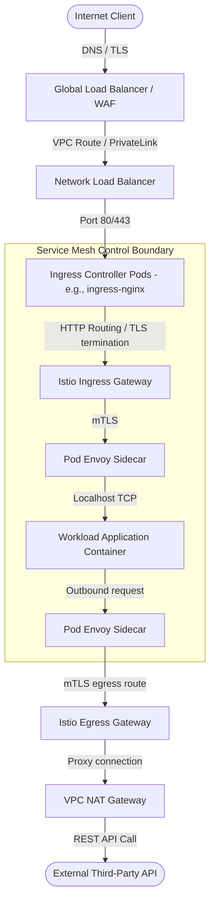

# 🚦 Ingress & Egress Traffic Architecture

This document describes how traffic enters the cluster (Ingress), gets routed to backend endpoints, and securely exits the cluster (Egress).

---

## 1. End-to-End Traffic Lifecycle



---

## 2. Ingress Infrastructure: Layer 4 vs Layer 7 Load Balancing

Traffic entering the cluster undergoes two levels of load balancing:

* **Layer 4 Load Balancer (NLB/ILB):** Provisioned by the cloud provider (via `type: LoadBalancer` services). It routes raw TCP connections to node ports across the cluster with high throughput. It does not look at HTTP headers or SSL certificates.
* **Layer 7 Ingress Controller (Nginx, Traefik, Envoy):** Runs as a set of Pods inside the cluster. It intercepts the HTTP requests, performs TLS termination, inspects paths/headers, applies rate limits, and proxies traffic to backend pod IPs.

---

## 3. Egress Control: Gateways & Proxy Filtering

In strict production systems, pods cannot connect directly to the public internet. This prevents data exfiltration and server tampering.

### Egress Restriction Mechanics:
1. **Private Subnets:** Worker nodes run on private VPC subnets with no public IPs. All outbound traffic routes through a managed NAT Gateway.
2. **Egress Gateways:** Within the service mesh, workloads are blocked from initiating external connections directly. They must forward outbound traffic to a central `Egress Gateway`.
3. **FQDN Filtering:** Egress Gateways inspect SNI headers and allow connections only to whitelisted external domains (e.g., `*.github.com` or `api.stripe.com`), dropping all unauthorized egress attempts.

---

## 4. Production Ingress Manifest: Nginx Ingress Custom Header Configuration

```yaml
apiVersion: v1
kind: ConfigMap
metadata:
  name: ingress-nginx-controller
  namespace: ingress-infra
data:
  use-forwarded-headers: "true"
  compute-full-forwardfor: "true"
  ssl-protocols: "TLSv1.2 TLSv1.3"
  ssl-ciphers: "ECDHE-ECDSA-AES128-GCM-SHA256:ECDHE-RSA-AES128-GCM-SHA256:ECDHE-ECDSA-AES256-GCM-SHA384:ECDHE-RSA-AES256-GCM-SHA384"
  keep-alive-requests: "10000"
  upstream-keepalive-connections: "200"
```
This configuration secures SSL connections and optimizes connection reuse between Nginx and the backend services.
