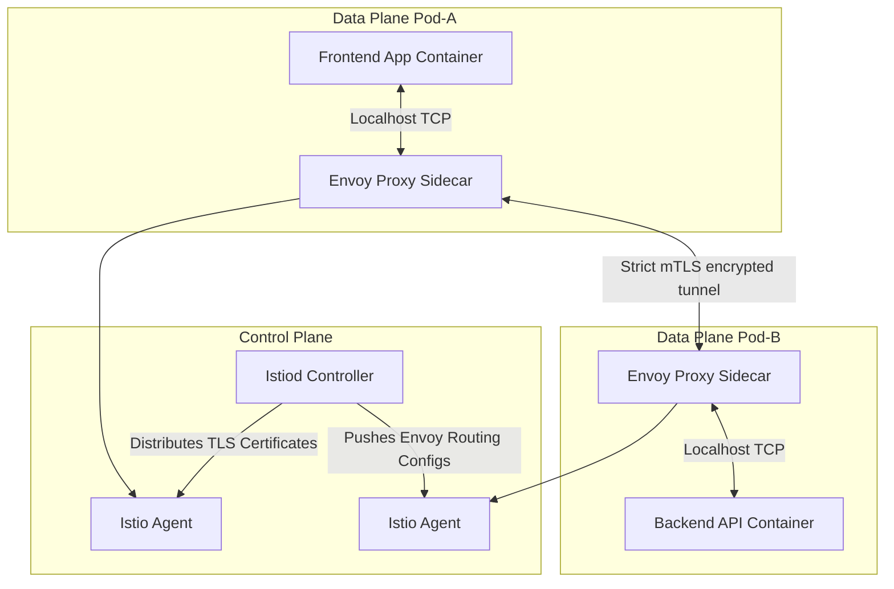

# 🕸️ Service Mesh & Mutual TLS (mTLS) Architecture

A service mesh provides infrastructure-level traffic management, observability, and security features without requiring modifications to application code.

---

## 1. Control Plane vs Data Plane Architecture

The service mesh divides its responsibilities into two separate execution areas:



* **Control Plane (`Istiod`):** Translates high-level declarative routing configurations and security policies into low-level Envoy configurations and pushes them to the sidecars. It also acts as a Certificate Authority (CA) to distribute short-lived cryptographic keys to the workload agents.
* **Data Plane (Envoy Sidecars):** Injected alongside application containers. Envoy intercepts all inbound and outbound network traffic, handling encryption, routing, and telemetry gathering.

---

## 2. Mutual TLS (mTLS) Mechanics

In standard TLS, the client verifies the identity of the server. In Mutual TLS (mTLS), **both** the client and server present certificates to verify each other's identity before establishing a connection.

### How mTLS works in Kubernetes:
1. **Pod Startup:** The sidecar agent initiates a Certificate Signing Request (CSR) to Istiod.
2. **Key Issuance:** Istiod validates the Pod's ServiceAccount token and returns a signed client/server X.509 certificate.
3. **Handshake:** When Pod-A calls Pod-B, the sidecar proxies negotiate an SSL handshake. They verify signatures, check expiration dates, and validate that the peer's ServiceAccount is authorized before forwarding payload data.

---

## 3. Traffic Management: Canary & Circuit Breaking

The sidecar proxies allow precise control over internal network behaviors:

### A. Circuit Breaking
If a backend service begins failing or latency spikes, Envoy trips a circuit breaker. This stops traffic routing to the degraded pod instantly, protecting the rest of the system from cascading failure.

### B. Canary Routing (Traffic Splitting)
We can split traffic based on percentages between production and canary services:
```yaml
apiVersion: networking.istio.io/v1alpha3
kind: VirtualService
metadata:
  name: ecom-backend-routes
  namespace: production-app
spec:
  hosts:
  - ecom-backend-svc
  http:
  - route:
    - destination:
        host: ecom-backend-svc
        subset: v1
      weight: 90
    - destination:
        host: ecom-backend-svc
        subset: v2-canary
      weight: 10
```

---

## 4. Performance Overhead Considerations

While a service mesh provides strong security, Envoy sidecars add network latency and consume memory:
* **Latency Overhead:** Every hop adds 1-3ms of latency due to TCP redirection (iptables rules) and cryptographic processing inside Envoy.
* **Memory Tuning:** Envoy caches routing paths for all services in the cluster. In large clusters, this can consume gigabytes of memory per pod. To prevent this, SRE teams use `Sidecar` resources to limit routing configurations to only the namespaces a pod actually needs to communicate with.
