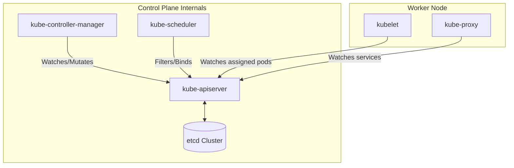

# 📖 Deep-Dive: Designing Production-Grade Kubernetes Architecture

This guide covers the core architectural concepts, internal service dependencies, and physical layout designs necessary to construct enterprise-grade Kubernetes platforms.

---

## 1. Platform Design Principles

When designing a production-grade Kubernetes cluster, the target architecture is guided by five core principles:

1. **Decoupled Architecture:** Build specialized, isolated worker pools for different workload classes (stateless web apps, stateful databases, batch processing, AI models).
2. **Blast Radius Minimization:** Control failures by organizing clusters into distinct namespaces, network policies, IAM boundaries, and separate clusters when necessary.
3. **Automated Recovery:** Ensure nodes and applications auto-heal without human intervention through health probes, replication controllers, auto-scaling pools, and node self-recovery scripts.
4. **Immutable Infrastructure:** Control plane and worker nodes should be treated as ephemeral resources. Node operating systems should be minimal (e.g., Bottlerocket, Talos, Flatcar) and updated via rolling node-replacement strategies.
5. **Least Privilege Enforcement:** Enforce Zero Trust boundaries at the API level, service mesh layer, container runtime, and host network.

---

## 2. In-Depth Control Plane Mechanics

The control plane represents the brain of the cluster. Understanding the network and compute requirements of each component is essential for maintaining stability.

### A. Kube-API Server Bottlenecks
The `kube-apiserver` acts as the frontend interface for the control plane. It is stateless but can become overloaded by:
* **High List Operations:** Massive controllers querying large resources without pagination.
* **Lease Saturation:** Nodes renewing lease heartbeats too frequently in large clusters (mitigated by separating leases into distinct namespaces).
* **Resource Auditing:** Inefficient admission webhook endpoints blocking request lifecycles.

### B. etcd Cluster Operations
etcd stores the declarative state of all Kubernetes resources. It uses the Raft algorithm, which is highly sensitive to write latency.
* **Database Size Limits:** The default db size limit is 2GB. SRE teams increase this up to 8GB via `--quota-backend-bytes` and run scheduled **defragmentation jobs** to reclaim space after large deletions.
* **Heartbeat & Election Delays:** In high-latency networks, etcd heartbeat parameters (`--heartbeat-interval` and `--election-timeout`) are increased to prevent accidental leader elections.

---

## 3. Worker Node Internals & CNI Topologies

Worker nodes run workloads and manage networking/storage resources locally.

### Kubelet Operations
The `kubelet` runs on each node, monitoring the API server for assigned pods.
* **PLEG (Pod Lifecycle Event Generator):** The Kubelet uses PLEG to poll container runtimes (containerd) for status updates. If PLEG latency spikes (often due to slow storage or high CPU contention), the Kubelet reports the node as `NotReady`.
* **Eviction Policies:** Kubelets monitor local disk space, memory, and inodes. If a node hits `--eviction-hard=imagefs.available<15%`, the Kubelet begins deleting unused container images and evicting lower-priority pods to save the host.

### Container Network Interface (CNI)
The CNI manages pod IP allocations and network routing.
* **AWS-VPC-CNI:** Allocates IP addresses directly from the AWS VPC subnet to each pod, enabling low-latency networking but risking VPC IP address exhaustion.
* **Cilium CNI (eBPF):** Replaces standard iptables rules with eBPF programs loaded directly into the Linux kernel. This improves network throughput and offers layer-7 network security and tracing.

---

## 4. Failure Domain Mapping

To build reliable platforms, you must identify physical failure domains and design Kubernetes abstractions to survive their failure.

| Physical Failure Domain | Impact | Kubernetes Mitigation Strategy |
| :--- | :--- | :--- |
| **Node Failure** | Loss of all pods running on node. | PodAntiAffinity, ReplicaSets, HPA. |
| **Zone Failure** | Loss of server rack or data center. | TopologySpreadConstraints, Multi-AZ Node Pools. |
| **Region Failure** | Complete cloud provider outage. | Multi-Region Clusters, DNS Failover (GSLB), Database Replication. |
| **Service Provider Outage** | Cloud platform API down. | Multi-Cloud Cluster Management (Anthos, Rancher). |
