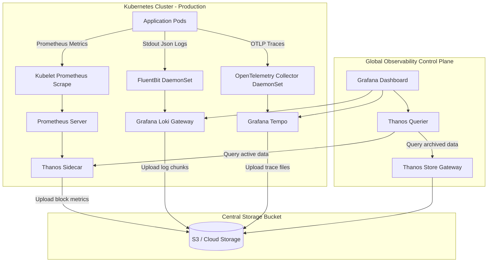

# 📊 Production Observability Architecture

This guide details the design of a highly available, multi-cluster observability stack using Prometheus, Thanos, Loki, OpenTelemetry, and Tempo.

---

## 1. End-to-End Observability Pipeline



---

## 2. Metrics Collection & Long-Term Storage (Thanos/Prometheus)

Standard Prometheus servers are stateful and store metrics on local disks. They are single-instance systems and do not scale horizontally. In production, we integrate **Thanos** to provide:

* **Long-Term Storage (LTS):** The Thanos Sidecar uploads Prometheus metrics blocks to cheap object storage (e.g., S3) every two hours.
* **Global Query Engine:** The Thanos Querier queries multiple Prometheus servers and historical object store blocks concurrently, deduplicating metrics in real-time.
* **Compactor:** A separate Thanos component that aggregates and downsamples historical metrics to optimize query speed over long timeframes.

---

## 3. Production Log Pipeline (Fluentbit & Grafana Loki)

To collect logs efficiently without exhausting node memory:
* **FluentBit (DaemonSet):** Runs on every node, mounts the host's `/var/log/containers` directory, parses logs into structured JSON payloads, and forwards them to a centralized log system.
* **Grafana Loki:** An index-free logging database designed for Kubernetes. Rather than indexing the log text (which consumes high memory, as Elasticsearch does), Loki indexes only the metadata labels (such as `namespace`, `pod_name`, `container`). This makes it highly cost-effective and easy to manage.

---

## 4. Distributed Tracing (OpenTelemetry & Tempo)

Distributed tracing allows developers to track requests across multiple microservice hops.
* **OpenTelemetry (OTel) Collector:** Receives traces in standard formats (Zipkin, Jaeger, OTLP), runs batch processors to deduplicate spans, and forwards them to Grafana Tempo.
* **Tempo:** A high-scale distributed tracing database that stores trace files in S3/Object Storage. It integrates with Loki, allowing users to jump from a specific log line to its corresponding trace span in a single click (Log-to-Trace correlation).

---

## 5. Alerting Principles & Service Level Indicators (SLIs)

Alerts should notify engineers only when user-facing reliability is degraded. We construct alerts based on the **Four Golden Signals**:

1. **Latency:** Time taken to service a request (e.g., HTTP 99th percentile response latency > 2s).
2. **Traffic:** Demand placed on the system (e.g., HTTP requests per second).
3. **Errors:** Rate of requests that fail (e.g., HTTP 5xx error rate > 1%).
4. **Saturation:** How full the service resources are (e.g., database connection pool utilization).

### Example Prometheus Alerting Rule: High Error Rate
```yaml
spec:
  groups:
  - name: application-errors
    rules:
    - alert: Http5xxRateElevated
      expr: sum(rate(http_requests_total{status=~"5.."}[5m])) by (service) / sum(rate(http_requests_total[5m])) by (service) * 100 > 5
      for: 2m
      labels:
        severity: critical
      annotations:
        summary: "High HTTP 5xx error rate on service {{ $labels.service }}"
        description: "The 5xx error rate for service {{ $labels.service }} has exceeded 5% over the last 5 minutes."
```
