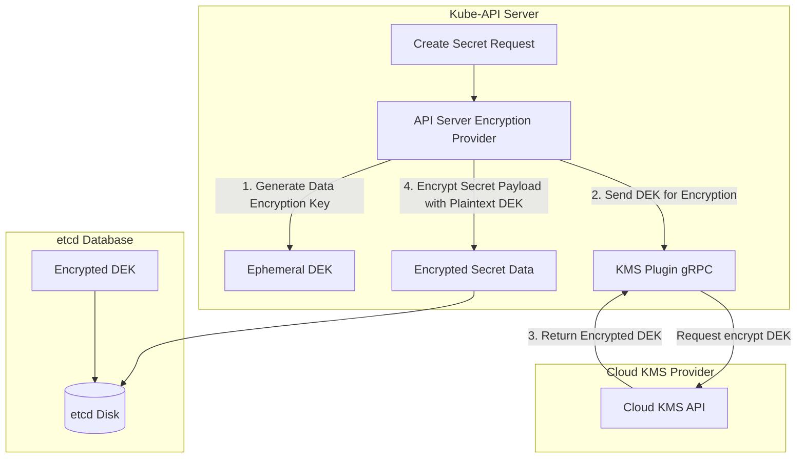
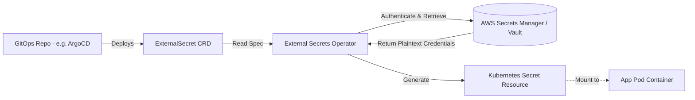

# 🔑 Secret Management & KMS Envelope Encryption

Kubernetes Secrets are, by default, stored unencrypted in etcd, only encoded in Base64. A compromised etcd snapshot or API access can expose sensitive credentials. This document details how to secure secrets in production.

---

## 1. Secrets Security Vulnerability & Mitigations

* **Vulnerability:** Standard Kubernetes secrets are stored in plain text inside the etcd database.
* **Mitigation 1 (Envelope Encryption):** Use a Key Management Service (KMS) to encrypt secret data before committing it to etcd.
* **Mitigation 2 (External Provider Secrets):** Store credentials in a dedicated vaults (e.g., HashiCorp Vault, AWS Secrets Manager) and inject them dynamically as volumes or synchronize them into the cluster using controllers.

---

## 2. KMS Envelope Encryption Architecture

To protect etcd data, Kubernetes implements envelope encryption using a cloud provider KMS key (e.g., AWS KMS, GCP KMS).



### Encryption Process:
1. The API Server generates a unique **Data Encryption Key (DEK)** locally.
2. The API Server forwards the DEK to the Cloud KMS API, which encrypts it using a Master Key (KEK) and returns the **Encrypted DEK**.
3. The API Server encrypts the secret data using the plain text DEK.
4. The API Server writes the **Encrypted Payload** along with the **Encrypted DEK** to etcd. The plaintext DEK is cleared from memory.
5. During a read operation, the API Server sends the Encrypted DEK to KMS to decrypt it, then uses the plaintext DEK to decrypt the secret data.

---

## 3. External Secrets Operator (ESO) Pattern

Instead of storing secrets in Git repositories (a GitOps anti-pattern), the **External Secrets Operator** synchronizes secrets from external vaults directly into Kubernetes Secret resources.



### YAML Configuration:
This configuration queries AWS Secrets Manager for database credentials and mounts them as a Kubernetes Secret.

```yaml
apiVersion: external-secrets.io/v1beta1
kind: SecretStore
metadata:
  name: aws-secretsmanager-store
  namespace: production-app
spec:
  provider:
    aws:
      service: SecretsManager
      region: us-east-1
      auth:
        jwt:
          serviceAccountRef:
            name: secrets-sync-sa
---
apiVersion: external-secrets.io/v1beta1
kind: ExternalSecret
metadata:
  name: database-credentials-sync
  namespace: production-app
spec:
  refreshInterval: "1h"
  secretStoreRef:
    name: aws-secretsmanager-store
    kind: SecretStore
  target:
    name: db-credentials
    creationPolicy: Owner
  data:
  - secretKey: password
    remoteRef:
      key: prod/ecommerce/db
      property: db_password
```
---

## 4. Secret Injection via CSI Secrets Store

For environments that cannot store secrets on disk at all, we use the **CSI Secrets Store Driver**:
* **Mechanism:** Mounts secret assets directly from AWS Secrets Manager or HashiCorp Vault into target pods as temporary in-memory volumes (`tmpfs`).
* **Benefit:** When the pod terminates, the secret data vanishes immediately from the node's disk, leaving no traces behind.
* **Auto-Rotation:** The CSI driver continuously polls the cloud provider for secret updates and mounts the new credentials into the running pod volume without requiring a deployment restart.
* **Sync to K8s Secrets:** If the application requires environment variables, the driver can optionally mirror the mounted secrets into standard Kubernetes secrets.
