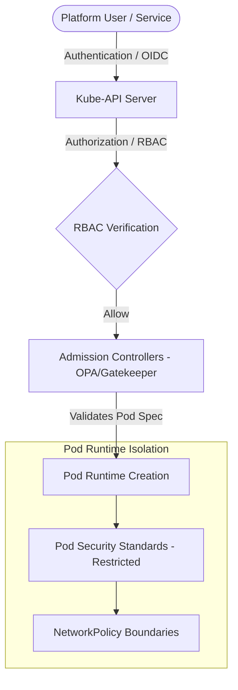

# 🛡️ Zero-Trust Security Architecture & RBAC

Implementing zero trust on Kubernetes means assuming that the network is compromised and enforcing strict access controls at the API, pod runtime, and network layers.

---

## 1. Access Control: Multi-Layer Security Model



---

## 2. Role-Based Access Control (RBAC) Hardening

A secure RBAC configuration follows the **Principle of Least Privilege**:

* **Never use administrative service accounts** for application runtimes.
* **Avoid wildcards (`*`)** in resource types and verbs.
* **Scope Roles to Namespaces** instead of granting cluster-wide ClusterRoles, unless absolute access is required (e.g., for logging agents).
* **Enable OIDC Authentication:** Integrate control plane authentication with enterprise identity providers (e.g., Okta, Active Directory) using short-lived tokens, avoiding static credentials.

---

## 3. Pod Security Standards (PSS)

Kubernetes enforces security boundaries on pods using three distinct profiles defined at the namespace level:

| Profile | Description | Enforced Restraints |
| :--- | :--- | :--- |
| **Privileged** | Unrestricted access. Allowed for system components. | Allows host namespace sharing, root containers, and volume access. |
| **Baseline** | Default profile. Prevents known privilege escalations. | Disallows host access, restricts host paths, restricts sysctls. |
| **Restricted** | Hardened profile. Minimizes container compromise risks. | Requires non-root user (UID != 0), drops all default Linux capabilities, disables volume host paths, enforces read-only root filesystems. |

### Enforcing Restricted Profile via Namespace Labels:
```yaml
apiVersion: v1
kind: Namespace
metadata:
  name: production-app
  labels:
    pod-security.kubernetes.io/enforce: restricted
    pod-security.kubernetes.io/enforce-version: v1.30
```

---

## 4. Policy Enforcement: OPA/Gatekeeper and Kyverno

Admission Controllers act as gatekeepers, auditing and rejecting pods that violate security policies before they are created.

* **OPA Gatekeeper:** Uses templates and Constraint templates written in the Rego language to define policies.
* **Kyverno:** Eases policy management by using standard Kubernetes resource syntax rather than Rego.

### Example Kyverno Policy: Enforce Read-Only Root Filesystem
```yaml
apiVersion: kyverno.io/v1
kind: ClusterPolicy
metadata:
  name: enforce-readonly-rootfs
spec:
  validationFailureAction: Enforce
  background: true
  rules:
  - name: check-readonly-rootfs
    match:
      any:
      - resources:
          kinds:
          - Pod
    validate:
      message: "Root filesystems must be configured as read-only."
      pattern:
        spec:
          containers:
          - securityContext:
              readOnlyRootFilesystem: true
```
---

## 5. Network Isolation Patterns
* **Default Deny Policy:** Every namespace should apply a default deny-all egress/ingress policy. This guarantees that traffic is blocked by default, requiring teams to explicitly white-list required communication paths.
* **API Server Access Control:** Limit access to the kube-apiserver using cloud security groups or firewall rules, blocking public internet queries to port 6443.
