# 📖 Day 29 - Cost Optimization & Performance Engineering

### 🏷️ PHASE 5 - REAL PRODUCTION SYSTEMS

Welcome to Day 29 of **30 Days of Production Kubernetes**. Today, we bridge the gap between infrastructure efficiency and financial accountability. In modern cloud native operations, engineers must build platforms that are both highly performant and financially optimized.

---

## 🎯 Learning Objectives
By the end of today's deep-dive, you will be able to:
1. Explain **why Kubernetes costs grow unexpectedly** and how to halt cloud billing growth.
2. Formulate **optimal requests and limits** for CPU and Memory based on empirical metrics.
3. Architect robust, failure-resistant **Spot Instance failover strategies** using Karpenter.
4. Establish **node bin-packing and consolidation automation** to eliminate idle compute overhead.
5. Identify and resolve **Linux kernel scheduling performance bottlenecks** (CFS throttling, OOMKills).
6. Implement **Kubecost/OpenCost-based FinOps operating models** for precise cost chargebacks.

---

## 1. Why Kubernetes Costs Explode

In virtualized machine architectures, pricing is linear: 1 VM = 1 Cost Tag. In Kubernetes, the shared multi-tenant pool model makes cost mapping invisible. Without direct guardrails, application growth spirals into immense cloud waste.

### The Cost Escalation Pipeline
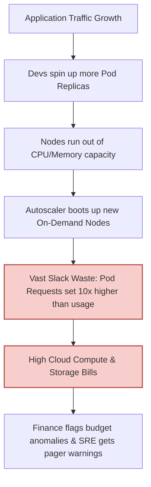

### The Kubernetes Cost Flow Model
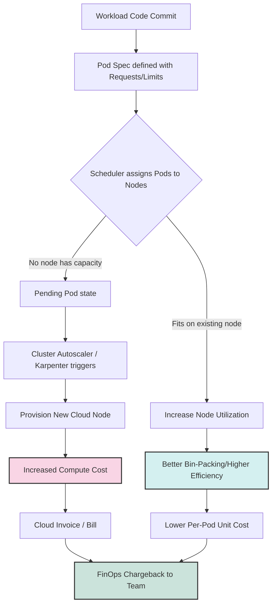

---

## 2. Right Sizing Deep Dive

Setting container resources is a delicate balancing act. Underprovisioning causes crashes (OOM) and lag (throttling); overprovisioning runs up massive bills.

### The Anatomy of Container Allocations
*   **CPU Requests**: The scheduler allocates this baseline to place pods on a node. CPU requests act as the OS CFS shares (`cpu.shares`).
*   **CPU Limits**: The maximum CPU time a container can consume within a CFS period (100ms). Exceeding this triggers **CFS throttling** (`cpu.cfs_quota_us`).
*   **Memory Requests**: The memory allocation reserved by the scheduler.
*   **Memory Limits**: The hard threshold enforced on the cgroup. Exceeding this triggers the **Linux Kernel Out-of-Memory (OOM) Killer (Exit Code 137)**.

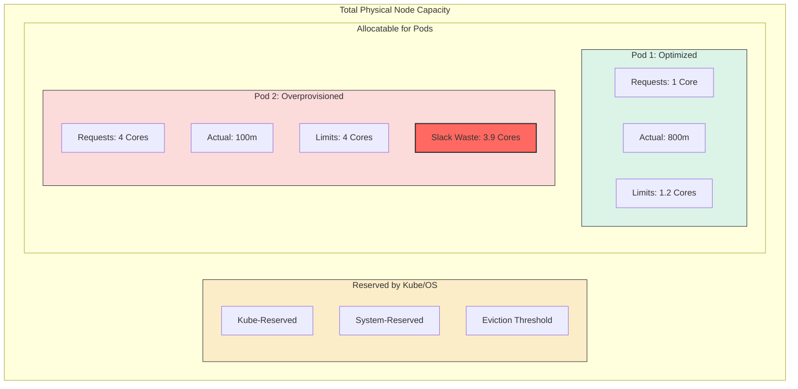

### Sizing Formulas (14-Day Window)
$$\text{Optimal CPU Request} = \text{Percentile}_{95}(\text{CPU Usage}_{14\text{d}}) \times 1.25$$
$$\text{Optimal Memory Request} = \max(\text{Memory Usage}_{14\text{d}}) \times 1.30$$

### The Right Sizing Feedback Loop
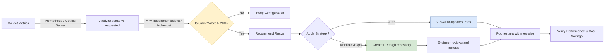

---

## 3. Spot Instances

Spot Instances allow you to run workloads on unused cloud capacity at **up to a 90% discount**. SREs must design workloads to tolerate abrupt reclaims (2-minute warning on AWS, 30-second warning on GCP/Azure).

### Spot Scheduling Architecture
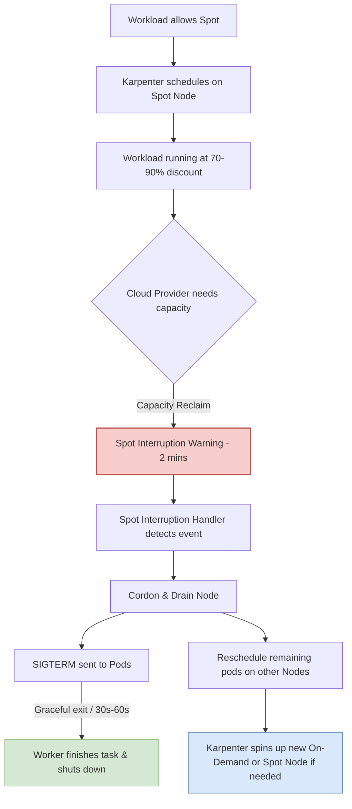

### Spot Workload Suitability Matrix
| Workload | Best Candidate? | Why? |
|---|---|---|
| **Batch processing workers** | **YES** | Stateless, pull jobs from queue, retryable. |
| **API Gateways & Core APIs** | **YES (Hybrid)** | Stateless. Run a blended pool of Spot and On-Demand nodes. |
| **CI/CD Build Runners** | **YES** | Interrupted jobs can be retried. |
| **SQL Databases & Message Queues** | **NO** | Stateful. Sudden shutdowns risk disk corruption and data loss. |

---

## 4. Resource Efficiency & Bin Packing

Resource fragmentation occurs when workloads are scattered sparsely across nodes, leaving enough aggregate free CPU/RAM to schedule pods, but split across nodes in quantities too small to schedule single pods.

### Fragmented vs Consolidated Node Bin-Packing
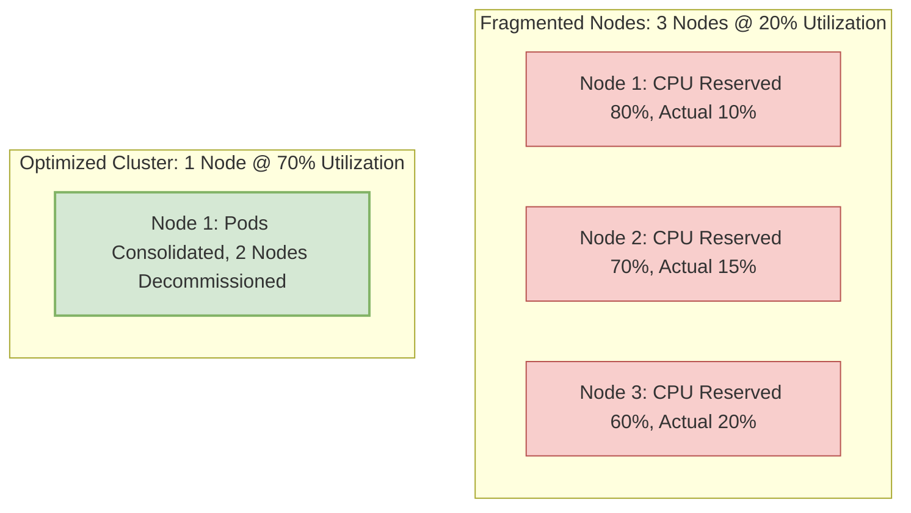

### The Resource Efficiency Framework
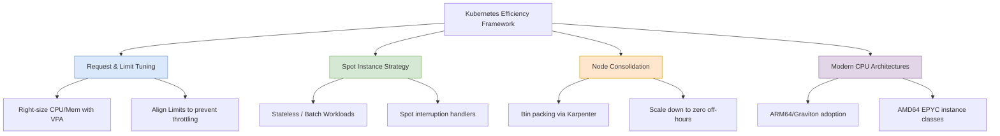

---

## 5. Performance Engineering & Bottlenecks

Cost optimization must never come at the cost of performance. Systems performance engineering requires monitoring low-level kernel metrics to identify when throttling compromises SLAs.

### Performance Bottleneck Analysis
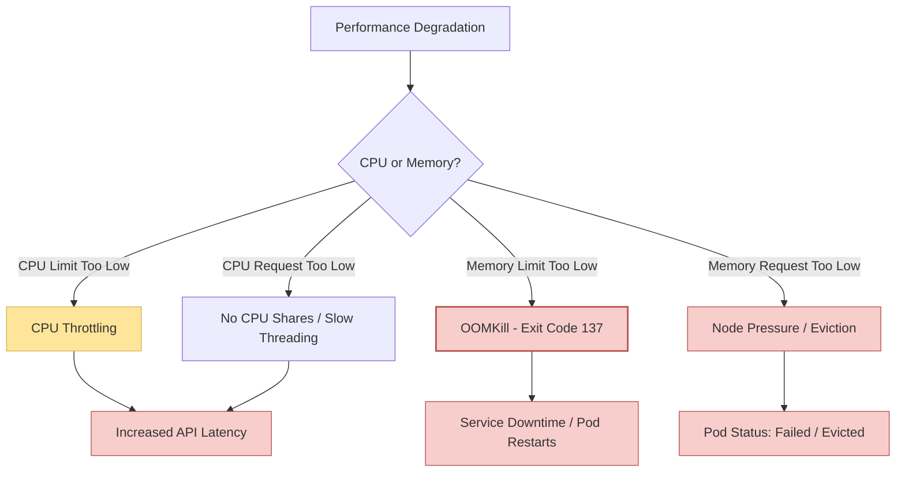

---

## 6. Autoscaling Coordination & Architecture

Proper resource efficiency relies on multi-tier autoscaling. The workload scales replicas horizontally (HPA), while the platform provisions and retires nodes (Karpenter).

### Autoscaling Feedback Architecture
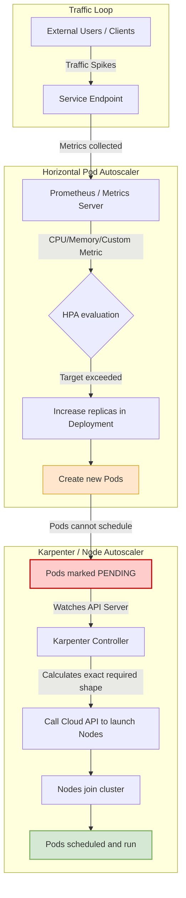

---

## 7. FinOps for Kubernetes

FinOps is an operational framework that establishes cost visibility and accountability.

### The FinOps Operating Model
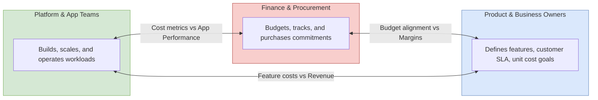

### The Cost Optimization Lifecycle
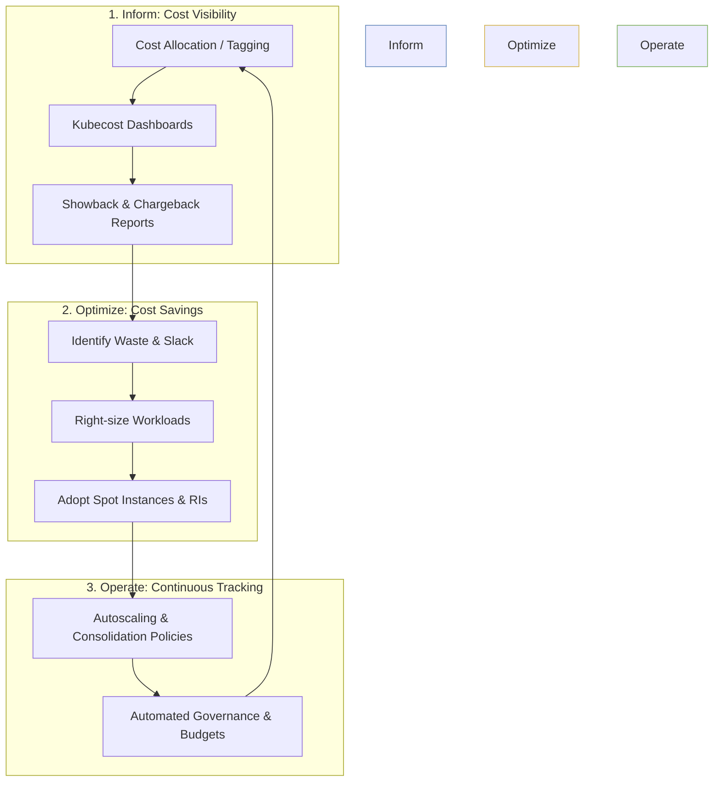

---

## 8. Real Production System Architecture Examples

To build high-performing, cost-efficient Kubernetes platforms, we apply targeted designs to specific workloads.

### A. SaaS Platform Architecture
*   **Design**: Namespace-per-tenant, Karpenter NodePool with isolation labels.
*   **Optimization**: Run development/tenant test spaces on Spot pools. Enforce off-hours scale-down to 0 replicas.
*   **Cost Breakdown**: 60% Spot compute, 20% On-Demand database nodes, 20% storage and network transfer.

### B. AI & Machine Learning Workloads
*   **Design**: GPU-enabled workloads (using `nvidia.com/gpu` limit schedulers).
*   **Optimization**: Set up aggressive scale-down-to-zero when training queues (Kubeflow / Ray) are empty, as idle GPU instances are extremely expensive (e.g., A100/H100 instances).
*   **Cost Breakdown**: 85% GPU instances, 10% high-throughput storage, 5% CPU/network nodes.

### C. Big Data Platforms
*   **Design**: Spark/Flink batch workers running on Spot nodes.
*   **Optimization**: Ensure Spark driver runs on On-Demand nodes, while executor pods run exclusively on Spot instances. Set high `terminationGracePeriodSeconds` and save checkpoints.
*   **Cost Breakdown**: 75% Spot executor nodes, 15% On-Demand driver/control nodes, 10% storage.

### Production Optimization Loop
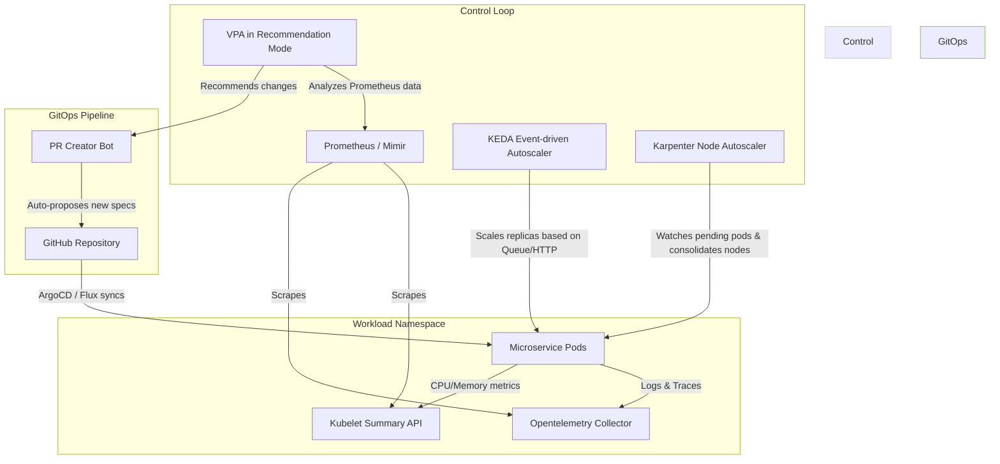

### End-to-End Cost Management Workflow
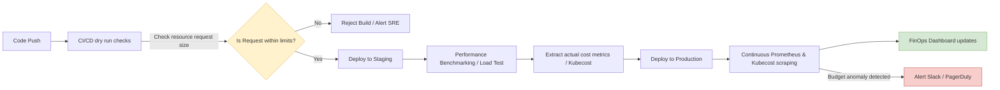

---

## 🛠️ Hands-On Labs Walkthrough
The following labs will guide you step-by-step through optimizing your cluster:

1.  **[Lab 1: Analyze Resource Waste](labs/lab-1-analyze-resource-waste.md)**: Identify resource slack and quantify waste.
2.  **[Lab 2: Right-Size Workloads](labs/lab-2-right-size-workloads.md)**: Configure VPA to size container allocations.
3.  **[Lab 3: Configure Spot Instances](labs/lab-3-configure-spot-instances.md)**: Deploy Spot-tolerating workloads.
4.  **[Lab 4: Optimize Node Utilization](labs/lab-4-optimize-node-utilization.md)**: Set up Karpenter Consolidation.
5.  **[Lab 5: Benchmark Pod Performance](labs/lab-5-benchmark-application-performance.md)**: Detect CPU CFS throttling under load.
6.  **[Lab 6: Tune Autoscaler Behavior](labs/lab-6-tune-autoscaling.md)**: Prevent scaling thrashing.
7.  **[Lab 7: Reduce Cluster Cost](labs/lab-7-reduce-cluster-costs.md)**: Clean up orphaned PVs and implement off-hours scaling.
8.  **[Lab 8: Improve Workload Efficiency](labs/lab-8-improve-workload-efficiency.md)**: Transition workloads to ARM64/Graviton.
9.  **[Lab 9: Build FinOps Dashboards](labs/lab-9-build-finops-dashboards.md)**: Design cost-tracking panels in Grafana.
10. **[Lab 10: Conduct Optimization Reviews](labs/lab-10-conduct-optimization-reviews.md)**: Establish risk-based platform audits.

---

## 🚨 Troubleshooting and Diagnosis Playbook
See the full details in our **[Troubleshooting Playbook](troubleshooting/troubleshooting-runbook.md)**.

| Error / Symptom | Root Cause | Resolution |
|---|---|---|
| **CPU Throttling** | Limit set below micro-burst needs | Remove limit or scale it to 1.5x - 3x of request |
| **Exit Code 137 (OOMKilled)** | Container exceeded memory limits | Increase cgroup memory limits |
| **Pods Stuck in Pending** | Autoscaler delays or capacity shortage | Configure low-priority pre-warmed pause pods |

---

## 🏆 Daily Challenge
Complete the **[Day 29 Challenge](exercises/exercise-challenge.md)**: take a bloated, $3,400/mo checkout microservice and refactor it into an optimized, Spot-friendly, autoscaling-optimized deployment manifest.
