# Day 30 — Master Project: Build a Real Production-Grade Cloud-Native Platform

Welcome to the grand finale of **30 Days of Production Kubernetes**! Today, you will combine every concept, pattern, tool, and architectural paradigm learned over the last 29 days to design, deploy, operate, and troubleshoot a unified production-ready cloud-native platform.

This capstone project is modeled after the industrial-scale architectures managed by platform engineering teams at tech giants like **Netflix, Uber, Spotify, Airbnb, and Google**.

---

## 🗺️ How the Course Phases Connect

A production-grade cloud-native platform is not just a collection of YAML files; it is a living, breathing ecosystem where all layers are deeply integrated. Here is how the five phases of **30 Days of Production Kubernetes** connect within this single capstone:

```
┌────────────────────────────────────────────────────────────────────────┐
│                      PHASE 5: REAL PRODUCTION SYSTEMS                  │
│  (Multi-region Failover, Runbooks, Platform Simulator, Load Testing)   │
└───────────────────────────────────┬────────────────────────────────────┘
                                    ▼
┌────────────────────────────────────────────────────────────────────────┐
│                    PHASE 4: ADVANCED ENGINEERING                       │
│     (GitOps ArgoCD, Karpenter Autoscaling, Stateful HA Postgres/Kafka) │
└───────────────────────────────────┬────────────────────────────────────┘
                                    ▼
┌────────────────────────────────────────────────────────────────────────┐
│                        PHASE 3: OBSERVABILITY                          │
│     (Prometheus Metrics, Loki Logs, Tempo Traces, Otel Collector)     │
└───────────────────────────────────┬────────────────────────────────────┘
                                    ▼
┌────────────────────────────────────────────────────────────────────────┐
│                   PHASE 2: RUNNING APPLICATIONS                        │
│     (Ingress Controllers, TLS Certificates, NetworkPolicies, RBAC)    │
└───────────────────────────────────┬────────────────────────────────────┘
                                    ▼
┌────────────────────────────────────────────────────────────────────────┐
│                       PHASE 1: KUBERNETES FOUNDATIONS                  │
│       (Multi-master Control Plane, Worker Nodes, Pods, Services)       │
└────────────────────────────────────────────────────────────────────────┘
```

1.  **Phase 1 Foundations** provides the physical container scheduling layer (multi-node, high availability).
2.  **Phase 2 Running Applications** wraps these containers with secure routing, automated certificates (cert-manager), and isolation walls (NetworkPolicies).
3.  **Phase 3 Observability** illuminates the platform, scraping telemetry data from the application code out to Prometheus, Loki, and Tempo via the OpenTelemetry Collector.
4.  **Phase 4 Advanced Engineering** automates operations through GitOps loops (ArgoCD), cost-optimized auto-provisioning (Karpenter), and cluster state persistence (PostgreSQL/Kafka).
5.  **Phase 5 Production Systems** adds the operational resilience: automated load tests, failure simulation, failover runbooks, and continuous compliance checks.

---

## 🏗️ 12 Architecture Diagrams

### 1. Full Production Architecture
This diagram displays the complete layout of the platform, showing control planes, workers, security boundaries, and telemetry lines.

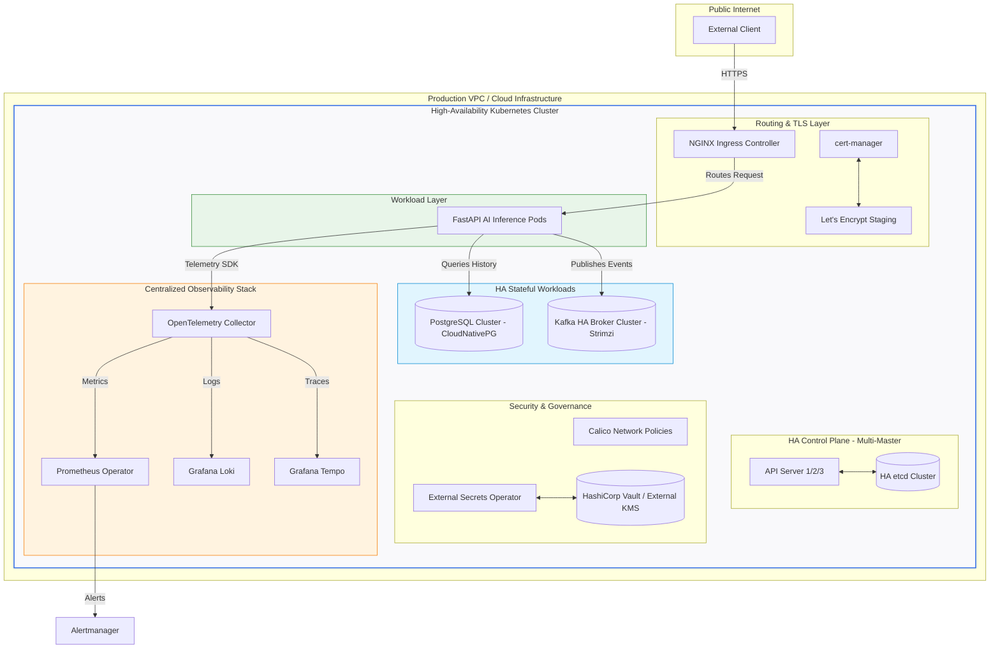

---

### 2. CI/CD GitOps Flow
How code flows from a developer's machine to the cluster using GitOps.

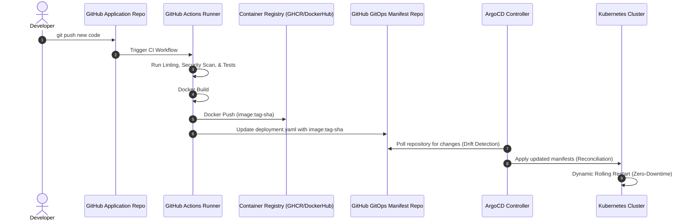

---

### 3. Monitoring Flow
The path of metrics from targets to notifications.

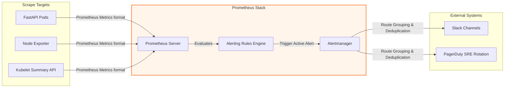

---

### 4. Centralized Logging Pipeline
Log collection, shipping, indexing, and visualization.

```mermaid
graph TD
    Pod1[FastAPI Container stdout] -->|Written to node disk| File[/var/log/pods/*.log]
    Pod2[Postgres Container stdout] -->|Written to node disk| File
    
    subgraph Shipping [Log Aggregator]
        Promtail[Promtail DaemonSet]
    end
    File -->|Tail & Label Logs| Promtail
    
    subgraph Storage [Log DB]
        Loki[Grafana Loki]
    end
    Promtail -->|HTTP Push Chunked Logs| Loki
    
    subgraph Visualization
        Grafana[Grafana Explorer]
    end
    Grafana -->|LogQL Queries| Loki
    style Shipping fill:#f2e6ff,stroke:#8000ff,stroke-width:1px
```

---

### 5. Metrics Pipeline
Metrics flow showing Prometheus monitoring architecture.

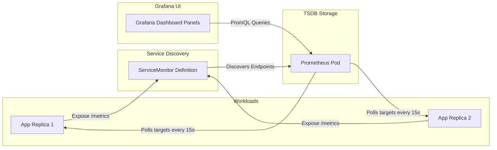

---

### 6. Tracing Pipeline
The path of distributed span traces.

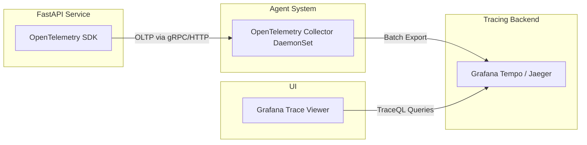

---

### 7. Autoscaling Flow
How the cluster responds to horizontal resource strain.

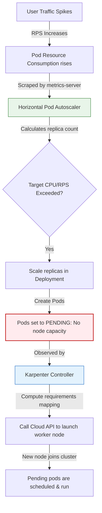

---

### 8. Security Architecture
The multi-layered security layout.

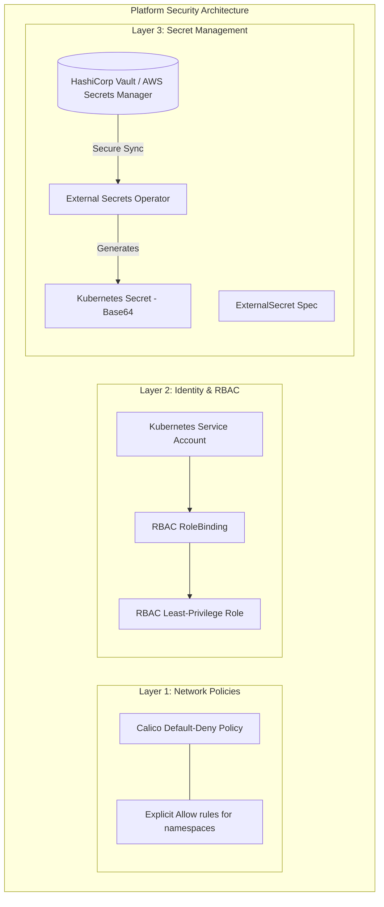

---

### 9. Data Platform Architecture
The transactional database and event pipeline.

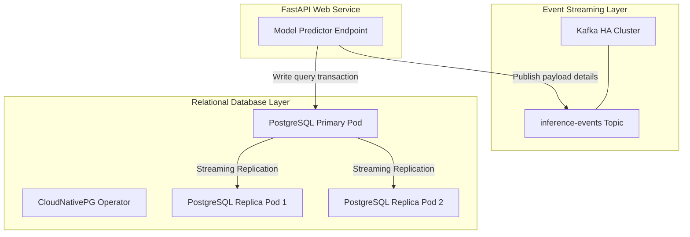

---

### 10. Disaster Recovery Architecture
Active-Passive multi-region failover.

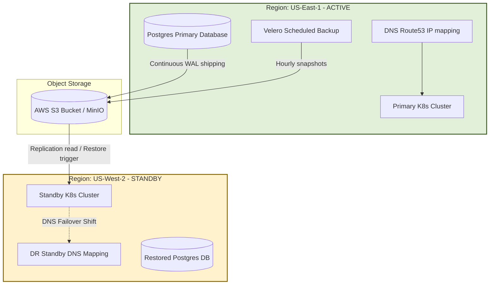

---

### 11. Network Architecture
Flow of IP packets inside the cluster.

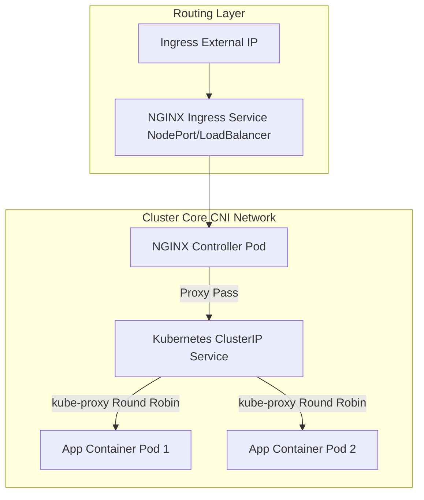

---

### 12. End-to-End User Request Flow
What happens to a single request.

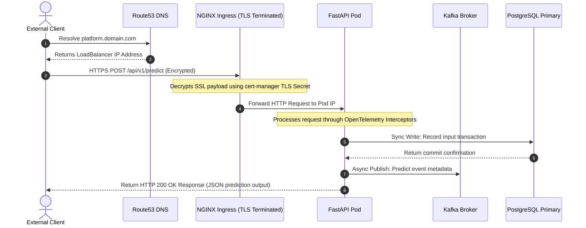

---

## 🛠️ Repository Directory Index

Here is the blueprint mapping files you will find in this repository:

```
Day-30-Master-Project/
├── 01-architecture/         # Architecture models and layout notes
│   └── README.md
├── 02-cluster/              # Local Kind HA configurations and deployment scripts
│   ├── kind-ha-config.yaml
│   └── setup-cluster.sh
├── 03-networking/           # Ingress & TLS configurations
│   ├── ingress-nginx.yaml
│   └── cert-manager-issuer.yaml
├── 04-security/             # RBAC scopes, NetworkPolicies, Vault secret configurations
│   ├── rbac-roles.yaml
│   ├── network-policies.yaml
│   └── secrets-vault.yaml
├── 05-monitoring/           # Alerting conditions and dashboard presets
│   ├── prometheus-rules.yaml
│   └── grafana-dashboard.json
├── 06-cicd/                 # GitOps definitions & GitHub Actions workflows
│   ├── argo-app.yaml
│   └── github-actions-workflow.yaml
├── 07-autoscaling/          # Workload (HPA/VPA) & Node autoscaling (Karpenter)
│   ├── hpa-vpa.yaml
│   └── karpenter-nodepool.yaml
├── 08-stateful-workloads/   # Stateful DB (CloudNativePG) & streaming clusters (Strimzi)
│   ├── postgres-ha.yaml
│   └── kafka-strimzi.yaml
├── 09-ai-data-services/     # FastAPI application and docker definitions
│   ├── fastapi-app/
│   │   ├── main.py
│   │   └── Dockerfile
│   └── k8s-deployment.yaml
├── 10-observability/        # Distributed tracing & aggregated log structures
│   ├── otel-collector-config.yaml
│   └── loki-promtail.yaml
├── 11-testing/              # Automated performance tests & chaos profiles
│   ├── k6-load-test.js
│   └── chaos-scenarios.yaml
├── 12-operations/           # DR runbooks & backup structures
│   ├── velero-backup.yaml
│   └── dr-failover-runbook.md
├── 13-troubleshooting/      # Failure mitigation playbooks & scripts
│   ├── scenarios.md
│   └── diagnose-platform.sh
├── 14-docs/                 # Educational cheat sheets & maps
│   ├── cheat-sheet.md
│   └── concept-map.md
├── 15-deliverables/         # Submission verification files
│   ├── submission-checklist.md
│   └── validate-deployment.sh
│
├── README.md                # This manual
├── PROJECT_GUIDE.md         # Hands-on labs manual
├── FINAL_CHECKLIST.md       # Final validation checklist
└── simulator.html           # Interactive Platform Simulator
```

---

## 🎯 Getting Started

To begin working through this capstone project:
1. Open and review [PROJECT_GUIDE.md](PROJECT_GUIDE.md) to read the 12 hands-on lab exercises.
2. Run `02-cluster/setup-cluster.sh` to spin up your local high-availability Kind cluster.
3. Open [simulator.html](simulator.html) directly in your browser to interactively understand how the systems respond to traffic spikes, configurations, failovers, and runtime failures.
